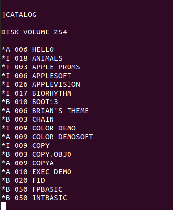
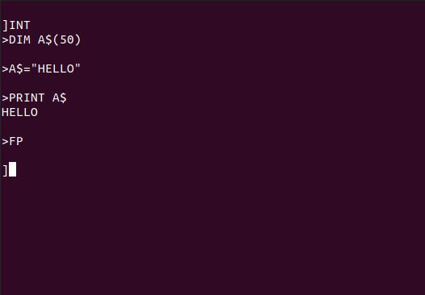
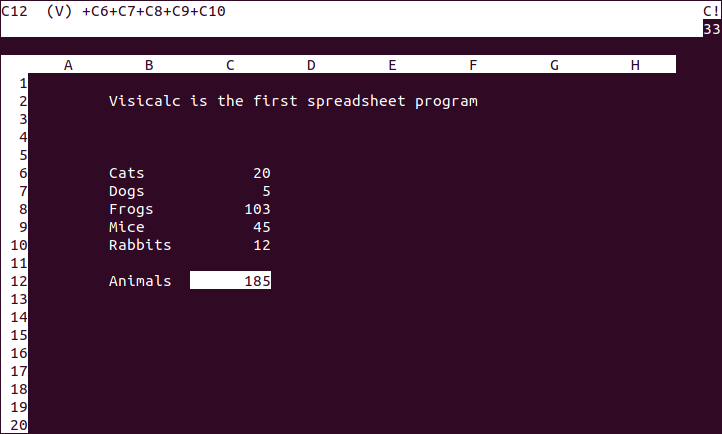
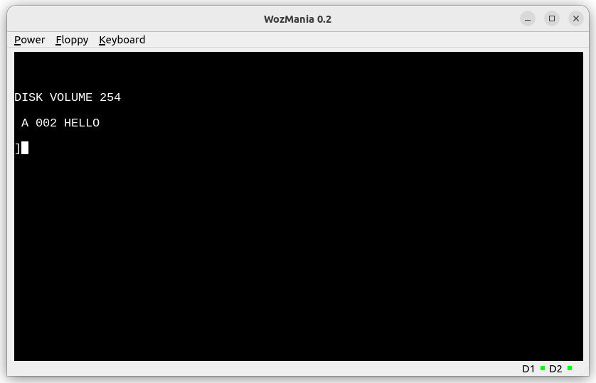

# WozMania: an Apple ][ emulator for ARM 64


[Top](wozmania.md): Table of Contents - [Next](debug.md): How to Debug


## How to Use


### Running WozMania

#### Requirements

To run WozMania, you need:

- a Linux system
- a 64 bits ARM processor
- at least 1 MB RAM
- at least 2 MB disk space
- an ANSI terminal with at least 26 rows and 80 columns
- if you want to use the GUI, a X-Window display.

#### Instructions

1. Assemble and install WozMania:
  * go to src/emulator subdirectory
  * run `make`
  * run `sudo make install`.
2. Download to the directory `/var/lib/wozmania/roms` a file
   named `APPLE2.ROM` that contains the ROM of the Apple ]\[.
3. Run the emulator with the command `wozmania`.
4. To exit the emulator, press F4.


If you plan to run Wozmania in a Graphical User interface:

1. Compile and install the GUI:
  * install the Qt5 development libraries
  * go to `src/gui` subdirectory
  * run `qmake wozmania-gui.pro`
  * run `make`
  * run `sudo make install`
2. Start the emulator by typing `wozmania &`
3. Start the GUI by typing `wozmania-gui`
4. To exit the emulator, select `Power` => `off` in the menus.

#### The ROM file

The ROM file must contain the last part of the memory. For example,
Apple ]\[+ ROM files covering memory from `$B000` to `$FFFF` are
20,480 bytes long (5 x 4,096). That's larger than the ROM space
(`$D000` to `$FFFF`, 3 x 4,096 bytes), but that's not a problem.

A configuration file named `/etc/wozmania.conf` allows to fine-tune
the emulated hardware at run time, as well as the paths to various
files. For example, to use a different ROM file, declare:
```
rom /path/to/some/other/rom/file
```

WozMania essentially tries to emulate an Apple ]\[+. While other models,
like the Apple //e, are out of focus, it is likely they will at least
partially work if you use the ROM corresponding to those models.

### Using the Keyboard

In text mode, the following keys are defined:

| Linux keys | Apple ]\[         |
| ---------- | ----------------- |
| Ctrl-C     | Ctrl-Reset        |
| F1         | Flush floppy disk |
| F3         | Ctrl-C            |
| F4         | Power off         |

You can set the ratio at which the keyboard is polled for real.
For example, if you set in `/etc/wozmania.conf`:
```
keyboard_poll_ratio 7
```
it means that keyboard is polled for real only one time
out of 128 (2^7 = 128). The idea is to accelerate the emulator
by not spending more time in system calls than necessary.
The default value is 8, meaning the keyboard is polled only
one time out of 256.


### Using the Floppy Disks

WozMania emulates a floppy disk controller in slot 6.

#### Supported formats

The file `/var/lib/wozmania/disks/blank.nib` represents the low level
contents of a blank disk inserted in a floppy drive. It contains
232,960 nibbles (35 tracks of 13 sectors of 512 nibbles).
Two nibbles are needed to represent one useful byte, therefore that's
only a capacity of 35 track of 13 sectors of 256 bytes.

You can also use files in `.dsk` format.
`/var/lib/wozmania/disks/blank.dsk` also represents the contents
of a blank disk. It contains 143,360 bytes
(35 tracks of 16 sectors of 256 bytes) in a slightly higher level
representation.

#### Using other disks



WozMania emulate two floppy drives. You can use other disks than
the two blank disks shipped with WozMania, for example you can use
the DOS master disk. To do that, download a file representing a
floppy disk somewhere and specify the path to this file in
`/etc/wozmania.conf`:
```
drive1 /path/to/some/other/disk
drive2 /path/to/yet/another/disk
```

The disk's format is recognized from the file name ending,
either '.nib' or '.dsk'.

If `drive1` or `drive2` is not specified in the configuration file,
the corresponding drive is considered as empty (no disk).
If the first drive is empty, the emulator still starts,
but the DOS hangs trying to read the floppy. In such a case, press Ctrl-C,
this will emulate a Ctrl-Reset and bring you to BASIC.

#### Saving Data

The blank disks shipped with WozMania are write-protected.
To write-protect any other disk in order to prevent accidental writing
to it, use a command like:
```
$ chmod -w mydisk.nib
```
This is equivalent to closing the write protection punch with black
tape on an original floppy disk.

All changes to the disk are written to a cache in memory. This cache
is flushed to disk when you exit the emulator.

You can force flushing the current disk at any time:
* by pressing F1 in text mode
* by selecting `Floppy` => `Flush` menu in graphical mode.

An unsaved cache is shown below the emulated screen:
* as `D1` or `D2` in text mode
* as a red light next to `D1` or `D2` in graphical mode.

#### Enabling or Disabling the Controller

To activate the floppy disk controller's ROM at `$C600`, specify in
the configuration file:
```
floppy enable
```

If the ROM file already contains ROM code for the floppy disk controller,
it will be ignored, and the firmware will be provided by WozMania.

You may completly disable the floppy disk controller by specifying:
```
floppy disable
```

If the ROM file already contains ROM code for the floppy disk controller,
it will be overwritten with a jump to the monitor.


### Using the Language Card

Apple's language card offers additional 16 KiB of RAM and 2 KiB of ROM,
and is inserted in slot 0. It is designed to host a language other than
Applesoft BASIC, like Integer BASIC or Pascal.

If you boot on the DOS system master disk, it loads the Integer BASIC
into the language card. You can then switch to this BASIC with the
command `INT`, and back to Applesoft BASIC with the command `FP`.



The Integer BASIC code also contains the mini-assembler. To
access the mini-assembler from the Integer BASIC, use the command
`CALL -2458`.

WozMania makes the following approximations:

* the emulator considers the ROM of the card as identical to
  the normal ROM of the Apple ]\[;
* when the language card is write-protected, it is enough to read
  only one time the relevant address to unlock the card.

Those simplifications should have no effect in real-life scenarios.

To activate the language card, specify in the configuration file:
```
langcard enable
```

You may completly disable the language card by specifying:
```
langcard disable
```


### Using the 80 Column Card

WozMania emulates a Videoterm 80 column card in slot 3 from
[Videx](https://videx.com/contact-us/about-videx/).

You can switch to 80 column mode from the BASIC by typing `PR#3`.
Some applications like [Visicalc](http://www.bricklin.com/history/saiidea.htm)
also take advantage of the Videoterm card.



WozMania makes the following approximation:

* the shared memory area (`$C800` to `$CFFF`) is always assigned to
  the 80 column card, no matter which card has been accessed last.

That simplification should have no effect in real-life scenarios.

To activate the 80 column card, specify in the configuration file:
```
80col enable
```

You may completly disable the 80 column card by specifying:
```
80col disable
```


### The Graphical User Interface

The WozMania GUI and the emulator are two separate programs.

The emulator communicates with the GUI via the Unix domain socket
`/tmp/wozmania.sock`.



In graphical mode, the following menus are defined:

| Linux menus                | Apple ]\[         |
| -------------------------- | ----------------- |
| `Power` => `Off`           | Power off         |
| `Floppy` => `Flush`        | Flush floppy disk |
| `Keyboard` => `Ctrl-Reset` | Ctrl-Reset        |

To run WozMania with the GUI, specify in the configuration file:
```
gui enable
```

You may return to the text mode by specifying:
```
gui disable
```


[Top](wozmania.md): Table of Contents - [Next](debug.md): How to Debug
